# FP Strukdat Kelompok 5

## Anggota Kelompok

| Nama                        | NRP        |
| --------------------------- | ---------- |
| Evandra Raditya Fauzan      | 5027251001 |
| Dea Chrisna Butarbutar      | 5027251035 |
| Akbar Reyhan Fabian Susanto | 5027251053 |
| Muhammad Yusuf              | 5027251067 |
| Naoval James Osamah         | 5027251092 |

## Tema Project

**Game Map Pathfinding AI**

Program Java berbasis CLI untuk simulasi pencarian jalur karakter game pada peta berbobot.  
Node merepresentasikan checkpoint pada map, sedangkan edge merepresentasikan route dengan terrain berbeda seperti `GROUND`, `FOREST`, `SAND`, `WATER`, `LAVA`, dan `WALL`.

## Struktur Data dan Algoritma

- **Graph**: weighted undirected graph dengan representasi adjacency list.
- **Tree**: custom binary heap.
  - `BinaryMinHeap` dipakai sebagai open list A*.
  - `CheckpointMaxHeap` dipakai untuk ranking checkpoint berdasarkan danger score.
- **Algoritma Graph**:
  - A* untuk pathfinding.
  - BFS untuk eksplorasi map.

## Fitur Utama

- Menampilkan semua checkpoint.
- Search checkpoint berdasarkan ID atau nama.
- Insert, update, delete checkpoint.
- Insert, update, delete route.
- Menampilkan struktur graph adjacency list.
- Menjalankan BFS dari checkpoint awal.
- Menjalankan A* untuk mencari jalur terbaik.
- Menampilkan total cost jalur.
- Menampilkan area yang tidak dapat dilewati.
- Mengubah bobot terrain dan membandingkan rute sebelum/sesudah perubahan.
- Membandingkan A* dengan heuristic Manhattan vs tanpa heuristic untuk analisis HOTS.
- Menampilkan checkpoint prioritas tertinggi dari heap.
- Menyimpan perubahan dataset ke file.

## Dataset

Dataset tersimpan di [data/dataset.txt](/Users/evandraraditya049/Kuliah/Kelas/STRUKDAT/fp/fp-strukdat-26/data/dataset.txt) dengan:

- 25 checkpoint.
- 40 route.
- lebih dari 5 atribut per checkpoint:
  - `id`
  - `name`
  - `x`
  - `y`
  - `zone`
  - `difficulty`
  - `loot`
  - `dangerScore`
  - `blocked`

## Struktur Folder

```text
fp-strukdat-26/
├── src/
│   ├── Main.java
│   ├── graph/
│   ├── model/
│   └── tree/
├── data/
│   └── dataset.txt
├── docs/
└── README.md
```

## Cara Menjalankan

Compile:

```bash
javac -d out $(find src -name '*.java')
```

Run:

```bash
java -cp out Main
```

## Catatan Implementasi

- `WALL` dianggap impassable.
- Heuristic A* memakai Manhattan distance berdasarkan koordinat checkpoint.
- Jalur hasil A* tetap optimal, sedangkan jumlah node yang diekspansi dibandingkan pada menu HOTS untuk menunjukkan pengaruh heuristic.

## Hasil Screenshot Program
1. Tampilan Menu

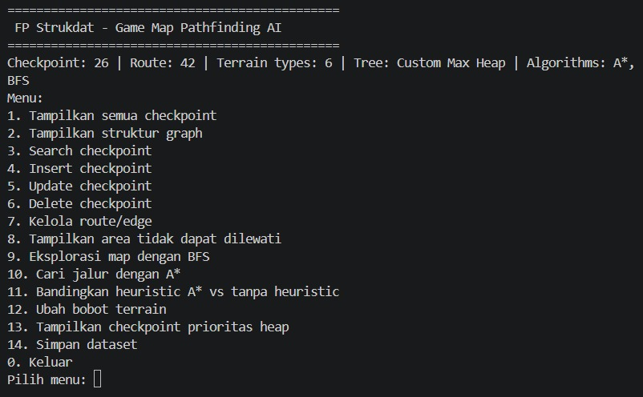

2. Menu 1: Tampilkan semua checkpoint

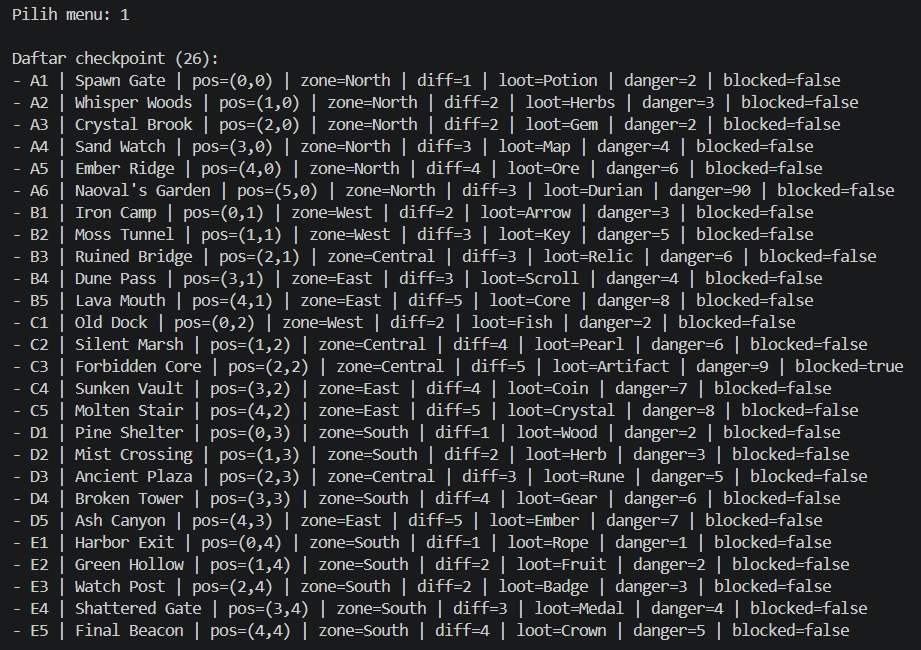

3. Menu 2: Tampilkan Struktur Graph

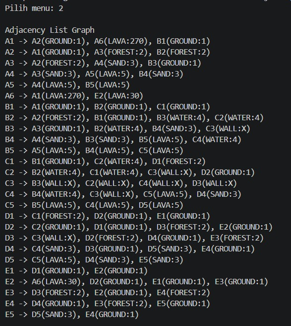

4. Menu 3: Search Checkpoint

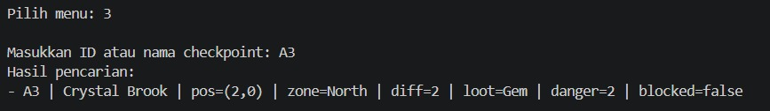

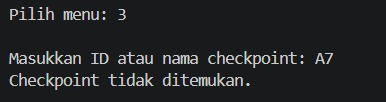

5. Menu 4: Insert Checkpoint

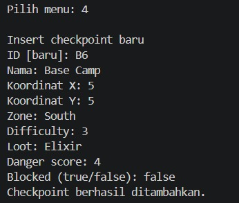

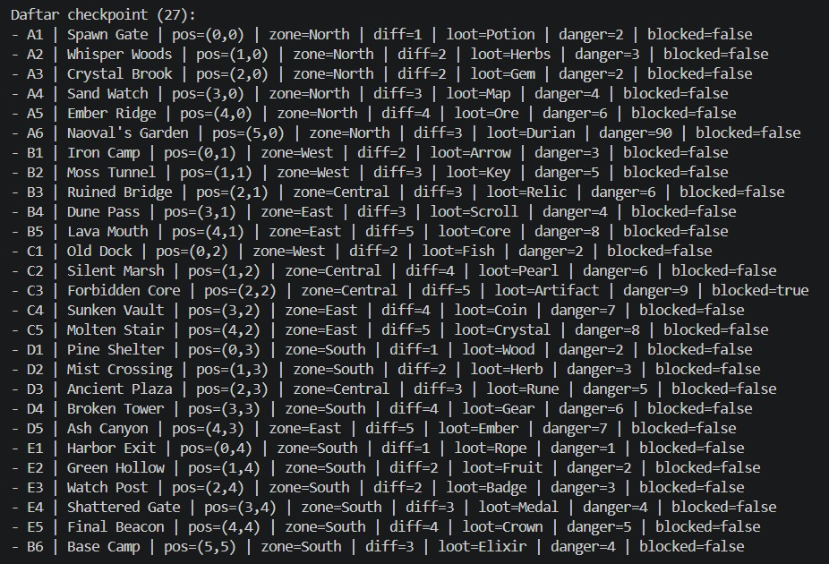

6. Menu 5: Update Checkpoint

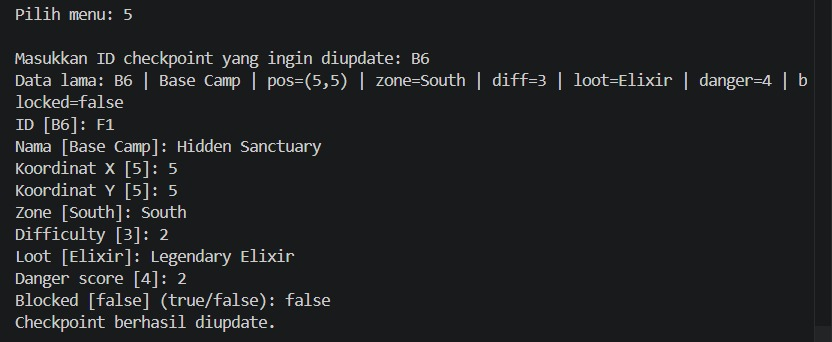

7. Menu 6: Delete Checkpoint

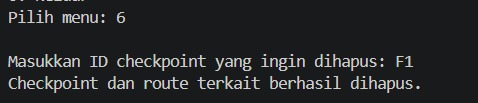

8. Menu 7: Kelola route/edge

- Tambah route

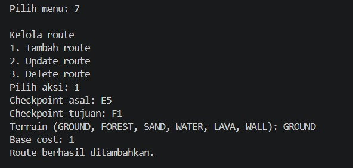

- Update route

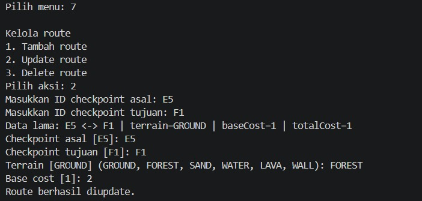

- Delete node

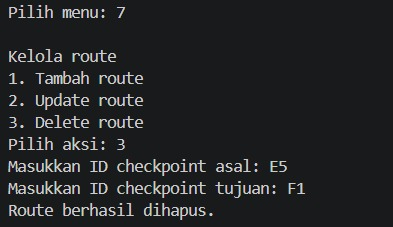

9. Menu 8: Tampilkan area tidak dapat dilewati

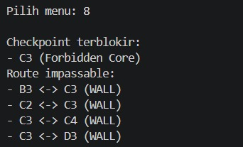

10. Menu 9: Eksplorasi map dengan BFS

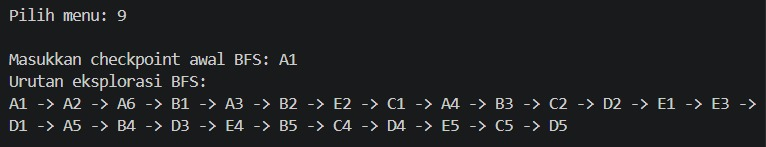

11. Menu 10: Cari jalur dengan A*

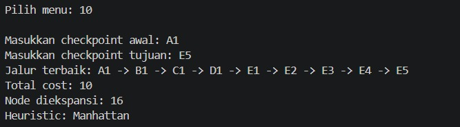

12. Menu 11: Bandingkan heuristic A* vs tanpa heuristic

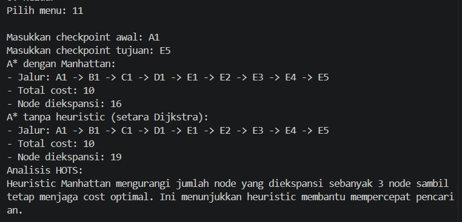

13. Menu 12: Ubah bobot terrain

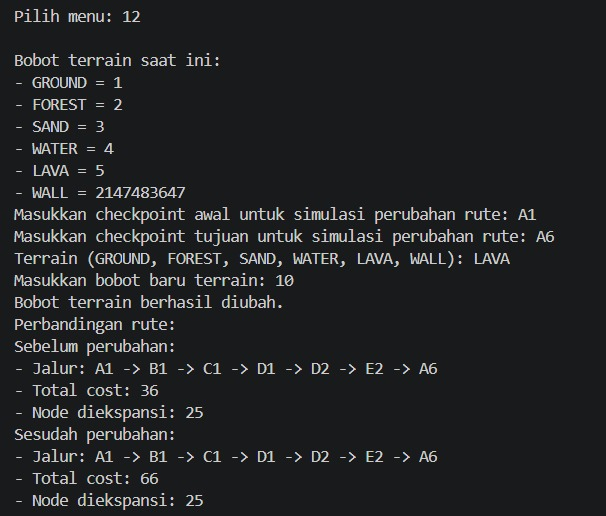

14. Menu 13: Tampilkan checkpoint prioritas heap

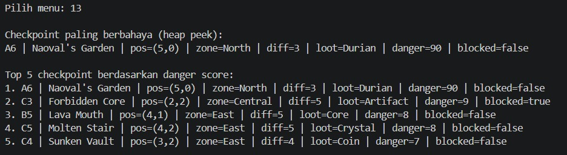

15. Menu 14: Simpan dataset

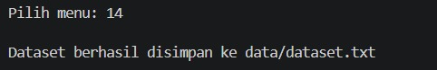

16. Menu 0: Keluar

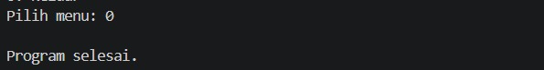

17. Menu selain 0 - 14

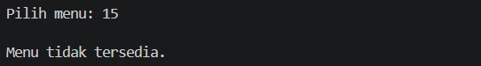
